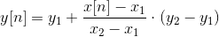
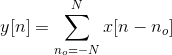
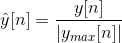

# TwiHub


Open source community promotes the collaboration between programmers around the world, and therefore increases efficiency. For example on the github, a user can "like" a repository by clicking the "star" button on the repository home page, yet a feature to "like" certain part of the program is missing (eg: certain lines of a cpp file that achieves recursion that catch your attention). 

Therefore, this project extends the idea of code sharing by enabling user to like a selected segment of the program, and displayed the numbers of likes as heat map next to each line. Furthermore, the state-of-the-art project adds sharing feature that could relay like messages to social media, like Twitter, and will contributes to the development of open source community.

## Build

```bash
tsc
```


## Heat Map Mathematical Model

Convert number of likes to height of heat map using linear interpolation and moving average

### Linear Interpolation



where (x1, y1) and (x2, y2) are index and height of two adjacent integer points.

### Moving Average



Normalize the vector,



